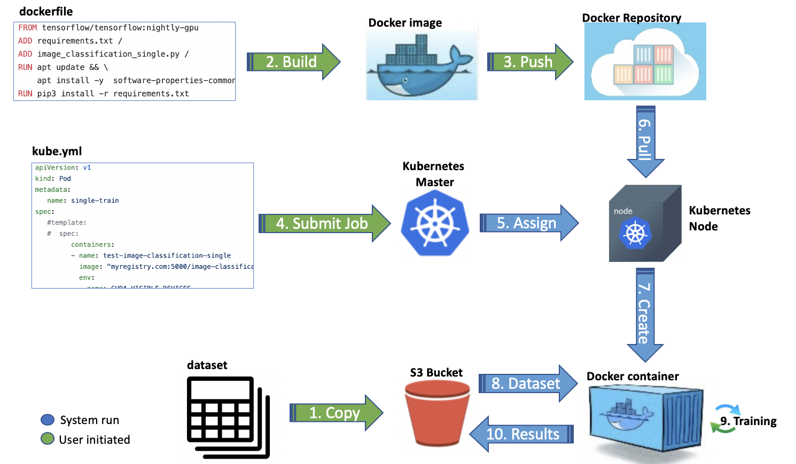

# Training a Open Source ML/DL model on AI Platform (Kubernetes) - Part II.

|   |   |
| ------------- | ------------- |
| **Difficulty**  |   |
| **Contact**  | Jax@[Slack](https://aidevplatform.slack.com) |

**Notice: Due to unforeseen circumstances, this example has yet to be tested on the AI Platform's GPUs. The example you see here are based on CPU runs. Once the example is tested on the platform, this notice will be removed.** 

Part I of this two part article series demonstrates a very simple example that runs a single iteration of a training model. In reality, this is very inefficient as most model training we have doesn't take up an entire GPU resources that the AI Platform offers (V100, 32GB). This article will demonstrate how to better utilise a single V100 GPU when submiting a job to Kubernetes. This example is created based on the possibility to load multiple CUDA programs to run on the same GPU, albeit with questionable speed depending on your model's complexity. (https://stackoverflow.com/questions/31643570/running-more-than-one-cuda-applications-on-one-gpu)

Note that this article can be followed through without going through Part I. The additional remarks that are unique in Part II are highlighted in _**italic bold**_.

## Who should try this?
### 3rd Parties
If you have a Deep Learning architecture you got from someone or pulled from open sourced research, and you need to perform some form of training on the model without intimate knowledge of the codes, this method would be most suitable for you. 
### Development in Docker
For those who are regularly developing their codes in Docker, this would be very apt for them as well. The advantage of developing DL models in Docker is that they highly flexible when it comes to using different frameworks and versions. For example, you don't have to crack your head on different versions of CUDA on your machine, just make sure you have a docker for every version. Most times, you don't even have to worry about this as the frameworks such as Tensorflow come with their own docker images anyway.

## What will be achieved at the end of this article?
This example uses a 3rd party end to end image classification code. The code is customised to download dataset frmo S3 onto itself and also to upload model checkpoints and final results onto S3 after training. By the end of this article, you will get acquainted with very basic use of Docker and Kubernetes. You would be able to submit jobs to Kubernetes and get the results from S3 object stores. _**This article focused on how multiple training jobs can run at the samee time on the same GPU. While this example is demonstrated via hyperparameter runs, you may adjust your own configuration to perform other actions concurrently**_

## Overview: Preparation and then the model training

The above diagram is a visual representation of the steps depicted in this article. Do refer to it if you get lost along the way with the mountain of words.

### Prerequisites
1. A client machine configured to connect to the Kubernetes cluster.
2. Docker installed on your own computer (Both Windows and Linux versions are fine)

### On your own computer
0. Prepare your datasets
1. Prepare your training codes
2. _**Introducing bashful**_
3. Prepare Dockerfile file
4. Build a docker image
5. Export/Save the docker image as a file_
6. Transfer to Kubernetes client

### On the Kubernetes client
0. Load datasets onto S3
1. Load the docker image file as a docker image
2. Push the docker image to the Docker Registry
3. Prepare kubernetes job yaml file
4. Run the job yaml file

## Step-by-Step
### On your own computer
#### Prepare your datasets
As we are submiting the jobs to the network for training, it means that your datasets needs to be accessible by several computers on the network via a shared storage. On the AI Platform, the following would be made available, S3, NFS and Hadoop. In this article, we will demonstrate with the use of S3 storage as it can cater to both structured and unstructured data.

We would be loading datasets into S3 via a network connection, so its generally more efficient if you transfer files as a zipped archive rather than thousands of individual files unless your training codes do it differently. Do zip up your datasets if you can, however, if you have extremely large datasets, or structured data in databases, you can prepare the data in their native forms.

#### Prepare your training codes
Your training codes should consist mainly of 3 parts.
1. Downloading of datasets from S3
2. Preprocessing and training of model
3. Uploading of models and results data to S3

Finally make sure your codes can run and train for at least an epoch to verify its working.

A sample of a training code is found in _**[image_classification_multi.py](https://raw.githubusercontent.com/jax79sg/kubejob/master/multi-train/image_classification_multi.py)**_. The only change to this code to the original is such that the zipped datasets would be downloaded from S3 and then extracted for processing, after training, the model and results are saved in S3. _**Additionally, hyperparameters are received via argparse.**_ Your situation could be different, please exercise your own considerations. 

A temporary MINIO S3 server has been setup in the AI Platform, your training codes should pull and save the data there. _**The [s3utility.py](s3utility.py) script shows the related codes,**_ this setups the helper codes and pulls the relevant parameters about the S3. 
The parameters are to be sent into the environment variables. You may also hard code the variables if that suits you, but i would encourage you to use either environment variables or argparse.
```python
### Setup of S3 parameters and helper functions

#Names of the buckets
trainingbucket= os.environ['trainingbucket'] #'training'
datasetsbucket= os.environ['datasetsbucket'] #'datasets'


import boto3 #boto3 is S3 client from AWS
from botocore.client import Config
s3 = boto3.resource('s3',
                    endpoint_url= os.environ['endpoint_url'] ,
                    aws_access_key_id= os.environ['aws_access_key_id'] ,
                    aws_secret_access_key= os.environ['aws_secret_access_key'],
                    config=Config(signature_version= os.environ['signature_version']),
                    region_name= os.environ['region_name'])

def s3_download_file(localfile,bucket,s3path):
    print("S3 Download s3://"+bucket+"/" + s3path + " to " + localfile )
    s3.Bucket(bucket).download_file(s3path,localfile)
    
def s3_upload_file(localfile,bucket,s3path):
    print("S3 Uploading " + localfile + " to s3://"+bucket + s3path+localfile)
    s3.Bucket(bucket).upload_file(localfile,s3path+localfile)
    
def s3_upload_folder(folder, bucket,s3path):
    
    from glob import glob
    print("Processing folder")
    for file in glob(folder+"/**/*",recursive=True):
      if (os.path.isdir(file)) == False:  
        print("Processing " + file)
        s3_upload_file(bucket='training',localfile=file,s3path='')
```
This part of the code will save the results into S3.
```python
### Up until this point,allthe model files are saved on container. After this container finishes execution, the files will be gone.
### Start saving the checkpoints and model files.
import json
with open('catdogclassification.json', 'w') as fp:
    json.dump(history.history, fp)
s3_upload_file(bucket=trainingbucket,localfile='catdogclassification.json',s3path='')

s3_upload_folder(bucket=trainingbucket,folder='catdogclassification_model',s3path='')

for epochrun in range(epochs):
    s3_upload_file(bucket=trainingbucket,localfile='catdogclassification_save_at_'+str(epochrun+1)+'.h5',s3path='')
```
_**A new python script [download_datasets.py](download_datasets.py) is created by extracting the data downloading codes**_

#### _**Introducing bashful**_
_**[bashful ](https://github.com/wagoodman/bashful) uses a yaml file to stitch together commands and bash snippets and run them, with the flexibility of doing it sequentially or concurrently. The bashful yaml for this example is located in [bashful.yml](bashful.yml). The config node should be reproduced in your own bashful.yml, but you are free to adjust the tasks node. 
Extract of this example's bashful.yml**_
```yaml
tasks:
    - name: download_datasets
      cmd: python /download_datasets.py
    - name: training
      parallel-tasks:
      - cmd: python /image_classification_multi.py --expid 1 --batch_size 128 --image_size_h 30 --image_size_w 30 --buffer_size 128 --dropout 0.50 --epochs 1 --learning_rate 0.01
      - cmd: python /image_classification_multi.py --expid 3 --batch_size 64 --image_size_h 30 --image_size_w 30 --buffer_size 64 --dropout 0.30 --epochs 1 --learning_rate 2.80
```

_**In the above yml, there are 2 main tasks, namely `download_datasets` and `training`. These are by default configured to execute sequentially. In the `training` task, there are 2 parallel sub tasks configured.**_
_**Its essentially the script to run the training, which provided different hyperparamters. Say it is known that each model training will take up about 7GB of GPU RAM, you may run up to 4 parallel trainings (32mod7). Please note that the env variable TF_FORCE_GPU_ALLOW_GROWTH must be set to True if you are using Tensorflow so that not all the RAM is allocated to one process**_

#### Prepare Dockerfile file
Now that you have your codes ready and tested locally, its time to dockerize it. Its really easy to create a Docker image, all you need is Docker installed, gather the files you want in the docker image and to create a simple file called Dockerfile. A Dockerfile is declarative, and the commands are only processed after you run `docker build`.

**_The following is the Dockerfile for this example.**_
```Dockerfile
FROM tensorflow/tensorflow:nightly-gpu
ADD requirements.txt /
RUN apt update && \
    apt install -y wget software-properties-common build-essential graphviz 
RUN wget https://github.com/wagoodman/bashful/releases/download/v0.0.10/bashful_0.0.10_linux_amd64.deb && \
    dpkg -i bashful_0.0.10_linux_amd64.deb
RUN pip3 install -r requirements.txt
ADD image_classification_multi.py /
ADD s3utility.py /
ADD download_datasets.py /
ADD bashful.yml /
```
Most Dockerfiles start off with a baseline image. There are a lot of images on [DockerHub](https://hub.docker.com/) and chances are that there's one that fits your purpose. Take for example, in this case the latest Tensorflow with GPU support is desired. Instead of creating a setup with CUDA and go through all the installation headache, a pre-made docker image by Tensorflow complete with CUDA and all is used instead. To do this, a `FROM` command followed by the tag `tensorflow/tensorflow:nightly-gpu` is used. 

Next, copy all the stuff required into the docker image by using the `ADD` command, followed by 2 arguments. The first argument is the path to the file, relative to the location of the Dockerfile file. The second argument is the path inside the docker image (The folders will be created automatically if it doesn't exists). So it will look something like `ADD requirements.txt /`. _**Note the differences with Part I. adding bashful executable and its yaml, adding s3utility.py and download_datasets.py **_

The codes won't run without the dependancies. In this example, graphviz and some python packages are quired. To this end, you can use the `RUN` command. For this  example, use `RUN pip3 install -r requirements.txt`. After this is acheived, you may proceed to build the image.

#### Build a docker image
To build the image with the docker file, you need to run the following command in the same folder where Dockerfile is located.
In this example, under the `kubejob/multi-train` folder.
```bash
jax@getafix: docker build .t image-classification-multi
 ---> ccd3aaa280b2
Successfully built ccd3aaa280b2
Successfully tagged image-classification-multi:latest
```
You can run `docker images` and see the docker image listed.
```bash
jax@getafix: docker images
REPOSITORY                                        TAG                              IMAGE ID            CREATED             SIZE
image-classification-multi.                       latest                           3793f6e38a2f        2 minutes ago       3.49GB
```
At this point, you can run the docker image on your own computer and run the training. This is the closest to which how it will run on kubernetes. Successfullying running this step will ensure that your image will most likely run properly on kubernetes.
```bash
jax@getafix docker run -it --gpus all --env-file env.list image-classification-multi /bin/bash -c "/bin/bash","-c","stty rows 25 && stty cols 96 && bashful run /bashful.yml"
```
`--gpus all` directs docker to use the GPU (provided nvidia-docker is installed)

`--env-file env.list` loads the environment variables (S3 parameters) into the docker container.
`"/bin/bash","-c","stty rows 25 && stty cols 96` is the command to start a new shell and default the tty dimensions
`bashful run /bashful.yml` is the command to run the bashful yaml

When you run the command, you would see something like following (*Note that this script ensures only 1 epoch is run for testing sake*)
```bash
Running /bashful.yml
    - download_datasets                                                                         
    - training                  
    ⠴ ├─ python /image_classification_multi.py --expid 1 --batch_size 128 --image_size_h 30 -...
    ⠴ ╰─ python /image_classification_multi.py --expid 3 --batch_size 64 --image_size_h 30 --...
```
#### Export/Save the docker image as a file
The above steps ensured that you have a running training script that will work on Docker. The next step is to export the docker image so you can transfer it to the Kubernetes client.
```bash
jax@getafix: docker save image-classification-multi -o image-classification-multi.tar
```
Now transfer the docker image to Kubernetes client

### On the Kubernetes client
#### Upload datasets onto S3
On the Kubernetes client, a MINIO client (commandline) has been configured for you to manage your buckets. 
In this example, the following command would have been executed.
```bash
jax@getafix: /home/user/mc mb myminio/datasets
Bucket created successfully `myminio/datasets`.

jax@getafix: /home/user/mc cp kagglecatsanddogs_3367a.zip myminio/datasets/kagglecatsanddogs_3367a.zip
...atsanddogs_3367a.zip:  786.68 MiB / 786.68 MiB ┃▓▓▓▓▓▓▓▓▓▓▓▓▓▓▓▓▓▓▓▓▓▓▓▓▓▓▓▓▓▓▓▓▓▓▓▓▓▓▓▓▓▓▓▓▓▓▓▓▓▓▓▓▓▓▓▓▓▓▓▓▓▓▓▓▓▓▓▓▓▓▓▓▓┃ 55.17 MiB/s 14s
```
Some basic usage of the commmands are as follows.

To create a new bucket 'mynewbucket', run the following command.
```bash
/home/user/mc mb myminio/mynewbucket
```
To upload a folders or files 'mylocalfolderorfile', run the following command.
```bash
/home/user/mc cp mylocalfolderorfile myminio/mynewbucket/
```
To download a folder or file 'mynewbucket', run the following command.
```bash
/home/user/mc cp myminio/mynewbucket/myremotefolderorfile mylocalfolderorfile
```
#### Push the docker image to the Docker Registry
The docker image file that we copied over from our own computer needs to be loaded into the Docker Registry on the AI Platform.
```bash
#Loads the tar file (docker image) into the client's local docker repo.
jax@getafix: docker load -i image-classification-multi.tar 
Loaded image: image-classification-multi:latest

#Tag the uploaded image to bear the url to the AI Platorm's Docker Rgistry.
jax@getafix: docker tag image-classification-multi dockrepo.dh.gov.sg/image-classification-multi:latest 

#Send the image from local Docker to the AI Platform's docker registry.
jax@getafix: docker push dockrepo.dh.gov.sg/image-classification-multi:latest 
The push refers to repository [dockrepo.dh.gov.sg:5000/image-classification-multi
94f43a58fd54: Layer already exists 
c394cd29e2f8: Layer already exists 
a7aabfd17751: Layer already exists 
be0113cc7bc0: Layer already exists 
21f7133a99fb: Layer already exists 
626976cc3d82: Layer already exists 
63beefd08b72: Layer already exists 
e8f3214614e5: Layer already exists 
cc3fc5898d66: Layer already exists 
7db070456ae6: Layer already exists 
10a49ffdc6d4: Layer already exists 
45a3946bc76a: Layer already exists 
43895ac43b99: Layer already exists 
808fd332a58a: Layer already exists 
b16af11cbf29: Layer already exists 
37b9a4b22186: Layer already exists 
e0b3afb09dc3: Layer already exists 
6c01b5a53aac: Layer already exists 
2c6ac8e5063e: Layer already exists 
cc967c529ced: Layer already exists 
latest: digest: sha256:1df82e72ddb603195af7b57034d536190ccbc2c3ee59faed9a4844d3c079b8da size: 4515
```
#### Prepare kubernetes job yaml file
The final step of preparation is to create a Kubernetes yaml file.
```bash
apiVersion: v1
kind: Pod
metadata:
   name: multi-train
spec:
         containers:
         - name: test-image-classification-multi
           image: "dockrepo.dh.gov.sg:5000/image-classification-multi"
           tty: true
           env:
           - name: SHELL
             value: "/bin/bash"
           - name: CUDA_VISIBLE_DEVICES
             value: "-1"
           - name: trainingbucket
             value: training
           - name: datasetsbucket
             value: datasets
           - name: endpoint_url
             value: http://minio.dsta.ai:9001
           - name: aws_access_key_id
             value: user
           - name: aws_secret_access_key
             value: password
           - name: signature_version
             value: s3v4
           - name: region_name
             value: us-east-1
           - name: TF_FORCE_GPU_ALLOW_GROWTH
             value: "true"
           resources:
              requests:
                 cpu: "1"
                 memory: "1Gi"
           command: ["/bin/bash","-c","stty rows 25 && stty cols 96 && bashful run /bashful.yml"]
         restartPolicy: Never

```
The above yml is a minimal yaml required for this example, with the important ones stated below.

`image` - Specify the image of that the job will run.

`env` - List the environment variables required to pass to the container.

`requests` - Minimum resources required for this container to run

`command` - command to run the script. _**Due to a limitation in bashful, we need to start a tty and give it a size before running bashful, the command `"/bin/bash","-c","stty rows 25 && stty cols 96 && bashful run /bashful.yml"` does just that**_

#### Run the job yaml file
Lastly, run the job submission.
```bash
jax@getafix: kubectl apply -f kube-multi.yml
pod/multi-train created
```

When a kubernetes job has been successfully submited, you can monitor 2 things, as indicated below.
Following command will display the pod that are in Kubernetes. The pod name takes after the `meta-data > name` in the yaml file.
```bash
jax@getafix: kubectl get pods
NAME           READY   STATUS      RESTARTS   AGE
multi-train    1/1     Running     0          4s
```
The following command will display the running stdout of the pod that you just created. The output should be similar to the docker run output above.
```bash
jax@getafix: kubectl logs multi-train
Running /bashful.yml
    - download_datasets                                                                         
    - training                  
    ⠴ ├─ python /image_classification_multi.py --expid 1 --batch_size 128 --image_size_h 30 -...
    ⠴ ╰─ python /image_classification_multi.py --expid 3 --batch_size 64 --image_size_h 30 --...
```

## Looking forward
This is an example on running on a single GPU. Please watch out for more blog posts on distributed training.

## Call for contribution
The above example is one of many possible ways to utilise Kubernetes for our AI development. If you have an interesting idea, please feel free to share it on our Slack page.
